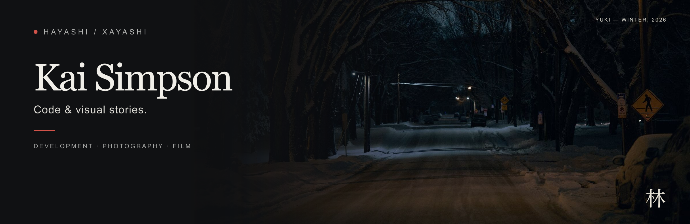
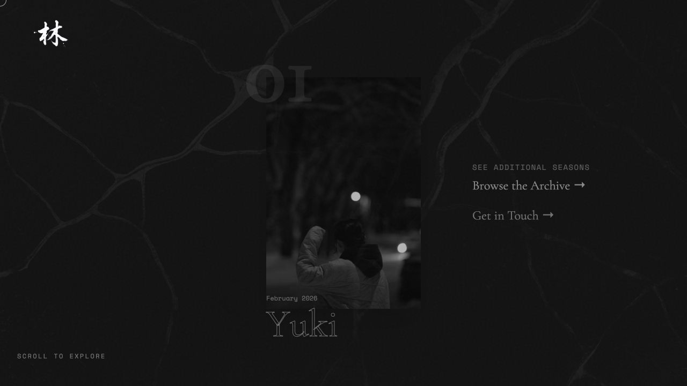
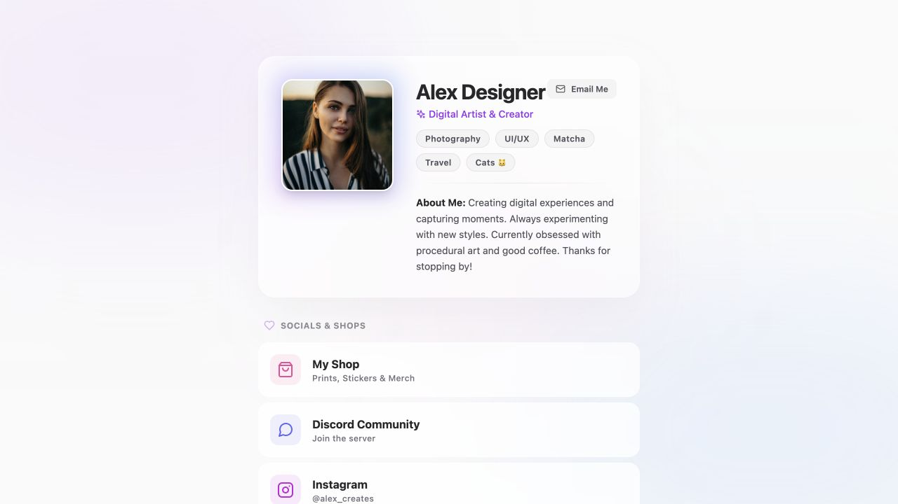

I build web experiences that give creative work a place to live. My projects explore responsive interfaces, motion, and ways to turn a collection of photographs into a story.

[Photography portfolio](https://photo-site-cyan.vercel.app/) · [Browse my projects](https://github.com/xayashi?tab=repositories)

## Selected work

<table>
<tr>
<td width="50%" valign="top">

<h3><a href="https://github.com/xayashi/PhotoSite">PhotoSite</a></h3>

Photography, told one story at a time. A horizontal gallery with Markdown stories, image lightboxes, and browser tests.

REACT · VITE · TAILWIND CSS

</td>
<td width="50%" valign="top">

<h3><a href="https://github.com/xayashi/AllSocialsLanding">AllSocials Landing</a></h3>

A small experiment in interface design: typed components, translucent cards, and responsive layouts. Preview uses sample profile content.

TYPESCRIPT · REACT · TAILWIND CSS

</td>
</tr>
</table>

## What I work with

**Frontend:** JavaScript, TypeScript, React, Next.js, HTML, CSS, Tailwind CSS  
**Beyond the browser:** Python, SQLite, Git  
**Creative interests:** photography, film, interaction design, and visual storytelling

Some of my coursework and collaborative projects remain private. The projects above are a small selection of my public work.
